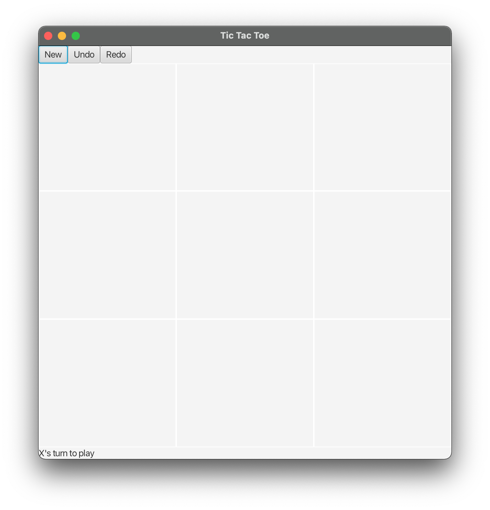
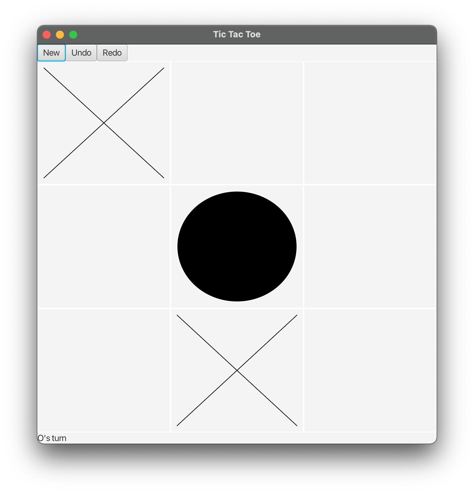
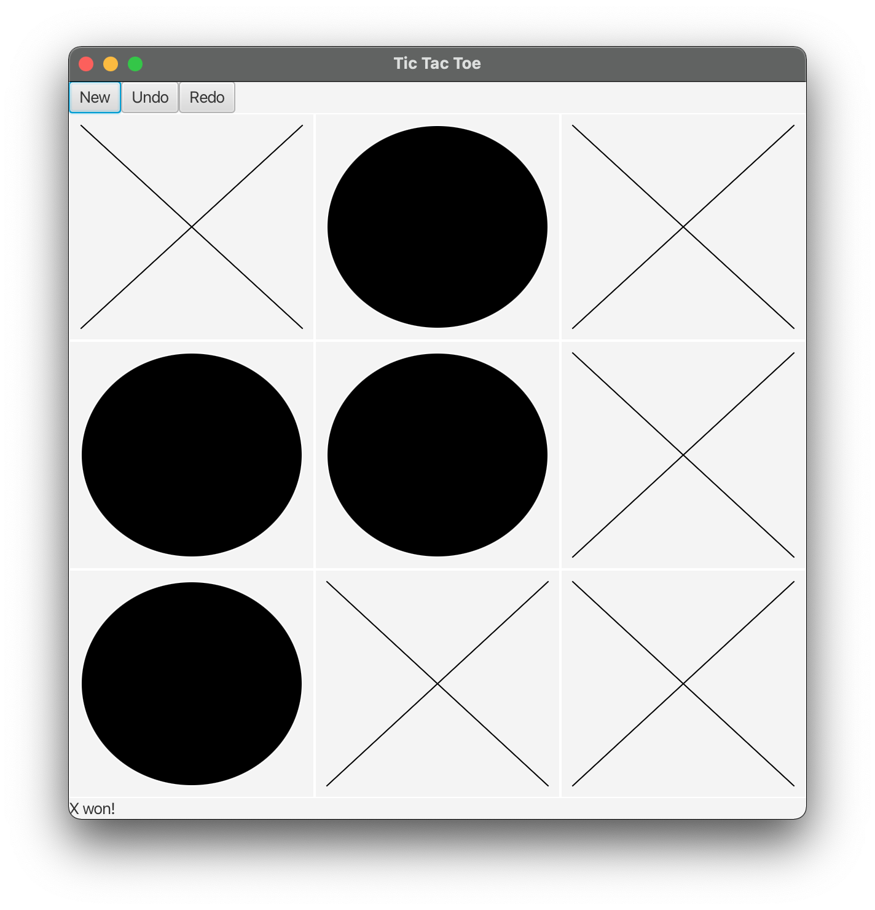
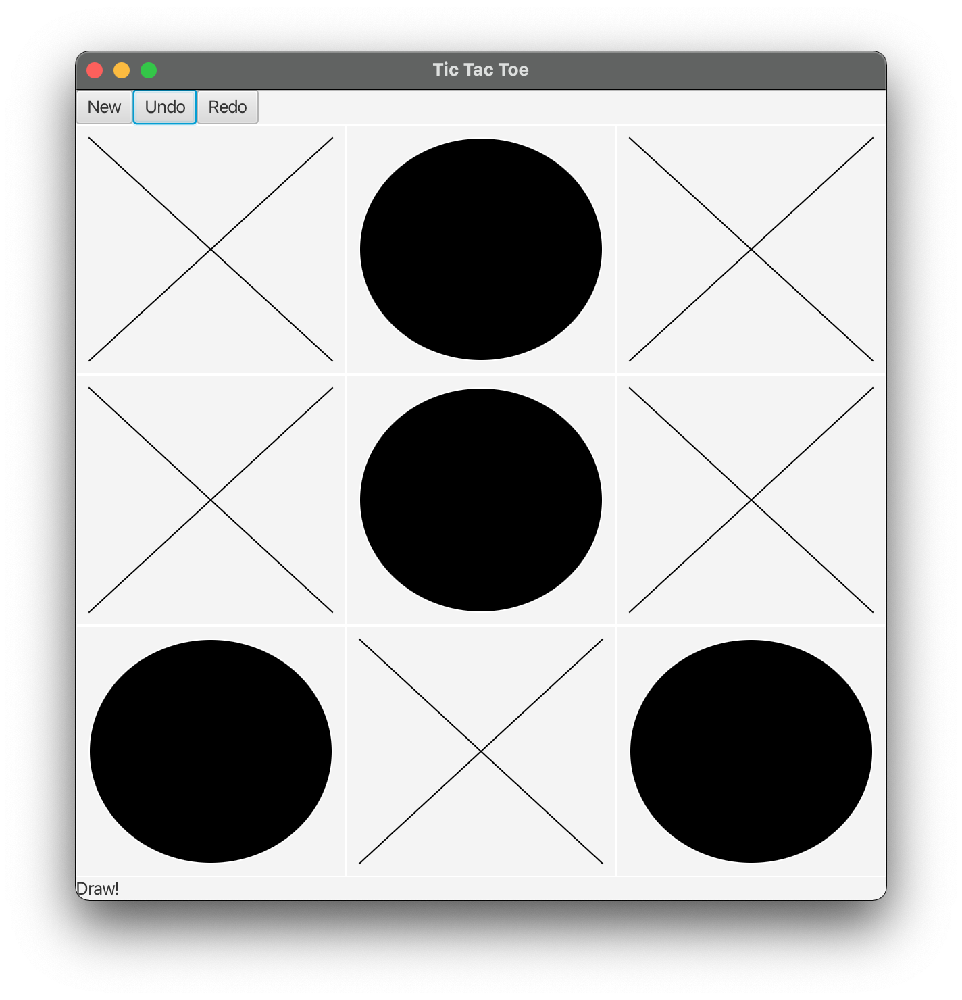
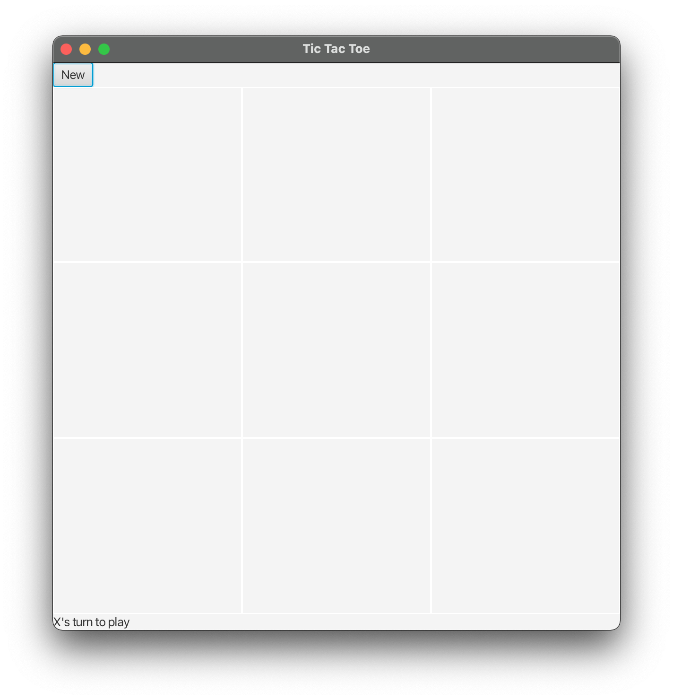
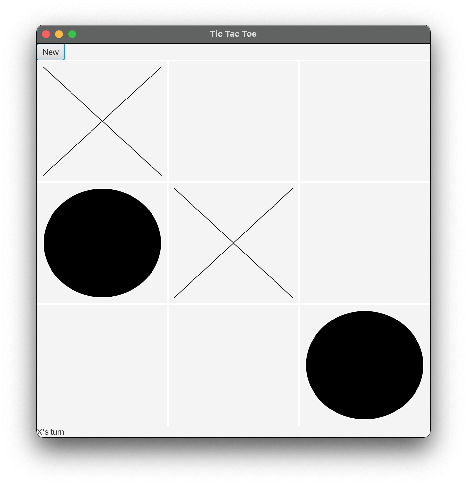
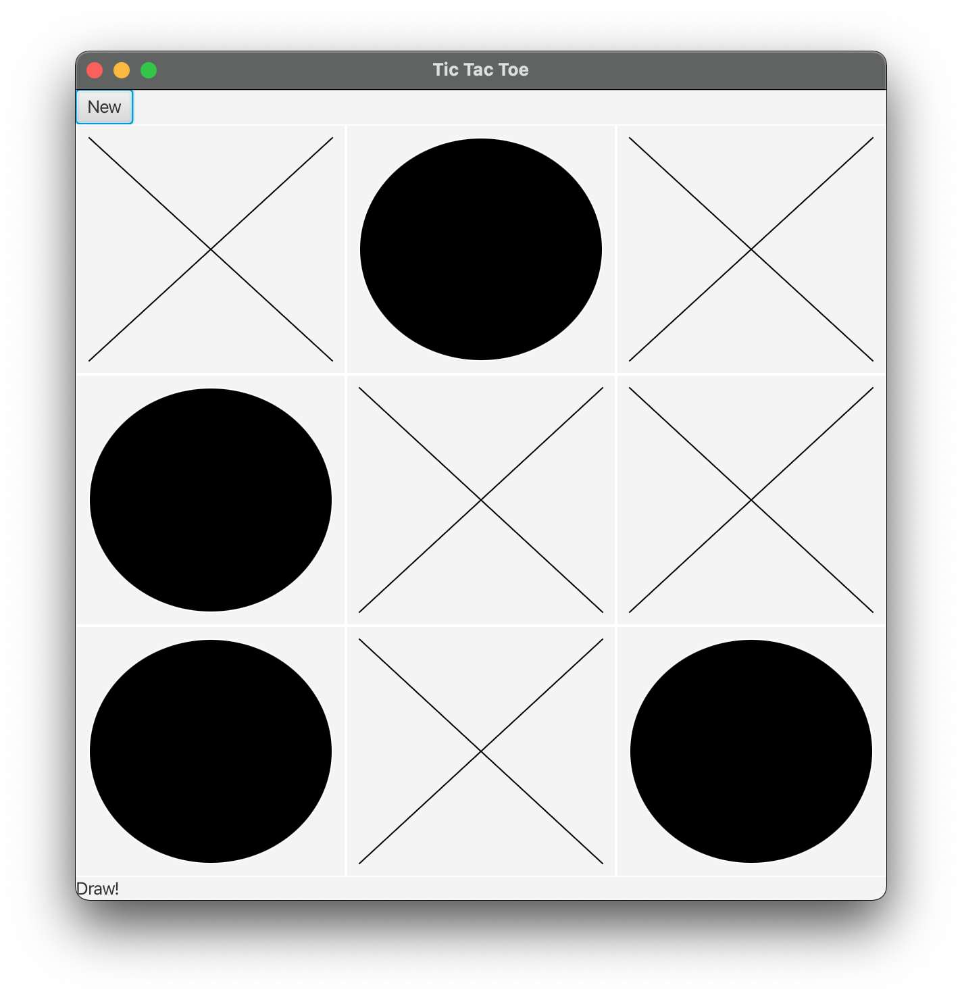
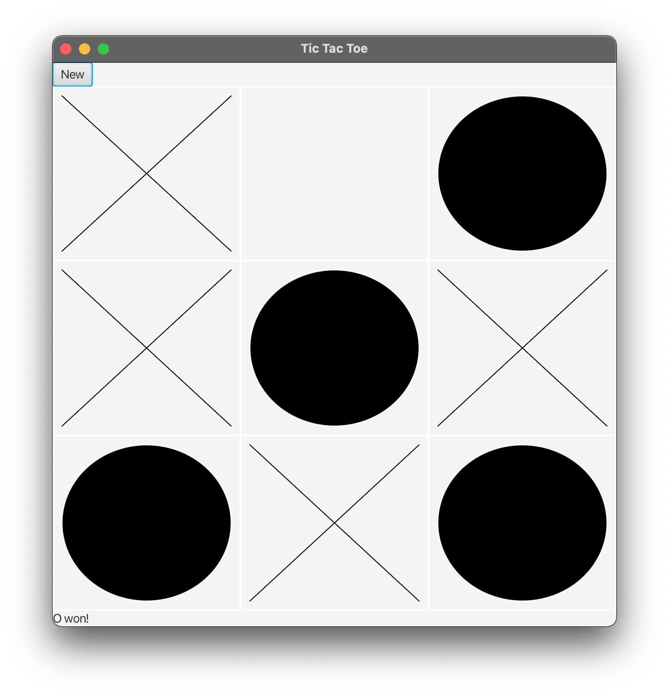
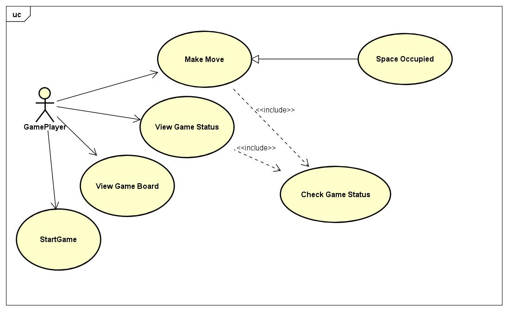
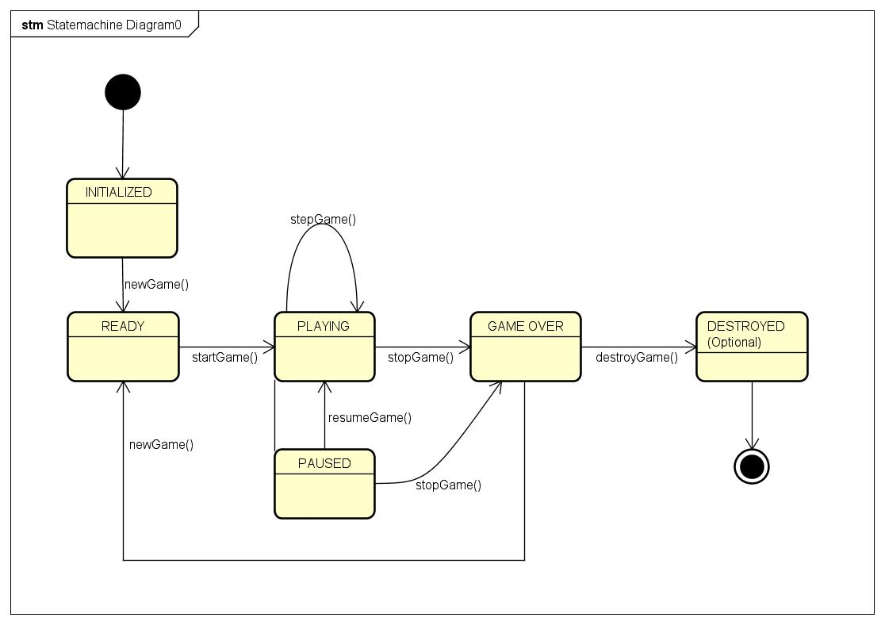

# Team Project (SPARTANS #Journal)

## Game Tic Tac Toe

Our project is to implement a well-known game, Tic Tac Toe, but having advance features such as Undo and Redo and have implemented the complete game using multiple design patterns.

## Team Members

1. Praneet Bang
2. Aditya Kopalli
3. Vishwa Tejendra pernapati
4. Hardik Ghori

## Team Individual Contributions

1. Praneet Bang
  Praneet learned about JavaFX sdk that we used in our project to implement the User Interface of the Tic Tac Toe game. He did the requirement analysis and contributed to the design of the game. He worked on the initial starter code for the project and then implement Decorator pattern for the 2 game modes in our project. Then, He worked on implementing chain of responsibility pattern for the functionality which checks if the game is a draw or if X or O won the game. He also created Class Diagram of our project and also maintained the Team Journal. 

2. Aditya Kopalli

The patterns implemented by Aditya in the following project

1. Singleton
2. State
3. Memento

1. Singleton - Make the class singleton by having a private contructor and initialising it only once.
2. State - Create multiple states based on the app behaviour
            a. WinState 
            b. DrawState
            c. ContinueState
As every move is made, you check if the move is win or lose. Based on that you run the state and perform its action. You have a StateManager to maintain the states for these.
3. Memento - You save the states of an object and use that for redo/undo. The main functionality lies in saving the state of the object in an array and restoring the state based on undo and redo

Classes

1. Singleton - SimplePage
2. State : StateMachine
                -> WonState
                -> DrawState
                -> NextState
3. Memento class - Memento class
                    a. Originator class
                    b. Caretaker class

3. Vishwa Tejendra pernapati
-- We have implemented 3 buttons for this game.
    1. New Game button
    2. Undo Button
    3. Redo Button

This Command Pattern comes into picture to run the appropriate logic when the player clicks on any of the obove buttons to perform the respective actions.

-- Making of ad video was interesting as I had included some good animations and transitions.

4. Hardik Ghori
  Understood the project requirements
  Explored GreenFoot and Java FX
  Implement TicTacToe logic
  Maintain project journal

## Game screenshots

### Advance Mode - 

### Standard Mode -

## UML Diagrams

### UseCase Diagram

### State Diagram

### Class Diagram

### Sequence Diagram

## Design Patterns used in the project

### Strategy Pattern 
A behavioral design pattern called strategy enables you to construct a family of algorithms, separate them into distinct classes, and make their objects interchangeable.

### Decorator
Decorator is used to attach additional responsibilities to an object dynamically. In this project, we have used Decorator for displaying two types of game modes, Standard Mode and Advance Mode.

In Standard Mode, players can play an ordinary tic tac toe game with only feature to restart the game.
In Advance Mode, Players can undo, redo their moves along with the functionalities of standard mode.

### Chain of responsibility
Chain of responsibilty is used to avoid coupling the sender of a request to its receiver by giving more than one object a chance to handle the request. The receiving objects are chained and the request is passed amongst the objects until an object handles it.

In this project, we are using this pattern for Checking the winner of the game. So, we have three handlers, where one checks if any row has sequence of X's or O's, if not, then it passes the request to column handler which checks if any column has sequence of X's or O's, and if not, then it passes the request to diagonals handler which checks if the diagonal or anti-diagonal has sequence of X's or O's

### Command Pattern
Many turn-based games include an "undo" button to let players reverse mistakes they make during play. This feature becomes especially relevant for mobile game development where the touch may have clumsy touch recognition. Rather than rely on a system where you ask the user "are you sure you want to do this task?" for every action they take, it is much more efficient to let them make mistakes and have the option of easily reverse the action.

So, we have implemented 3 buttons for this game.
1. New Game button
2. Undo Button
3. Redo Button

This Command Pattern comes into picture to run the appropriate logic when the player clicks on any of the obove buttons to perform the respective actions.

### Memento
Memento is used to capture and externalize an object's internal state so that the object can be restored to this state later. In this project, we have used Memento along with Command pattern in order to undo-redo the moves of Tic-Tac-Toe.

We can undo and redo multiple times without losing the state of the object. We would be storing the object state everytime the move is made. This allows us to move back to the previous state as we have the details of the previous state.

### State Pattern

State allows an object to alter its behavior when its internal state changes. The object will appear to change its class.

The Tic-Tac-Toe game can have 3 states based on each move.

1. Draw
2. Win
3. Next Move - Continue

The states continue to work until the game ends. We check the current state and update the state of the machine by checking the game status on every move.

## Singleton

Ensure a class only has one instance, and provide a global point of access to it.

Singleton has a private constuctor as we do not want the object to be created multiple times. The global access of the object is done using a static method which checks if the object creation is done and returns the current state of the object.

We can only have one instance of the object.

## User story video

https://youtu.be/3IBpcBAHkIo
